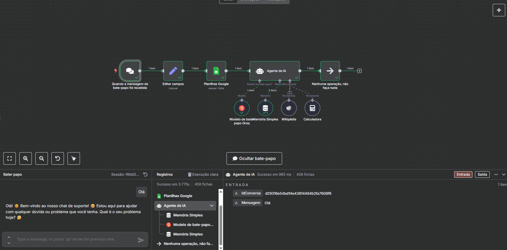
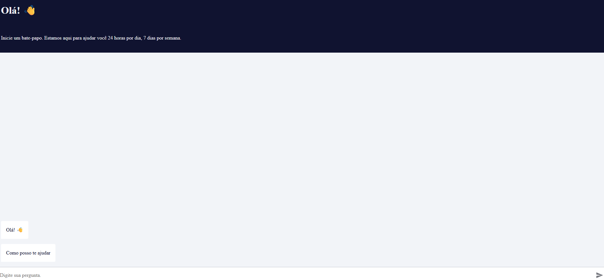

# 🤖 Chatbot com n8n + Google Sheets + LLM (Groq)

Este projeto é um chatbot inteligente criado com **n8n**, focado em IA aplicada, automações e integração low-code com ferramentas externas.  
Ele utiliza modelos LLM da Groq com memória de conversação via LangChain — tudo isso rodando localmente com Docker.

---

## 💡 Funcionalidades

- 🟢 Recebe mensagens via **Chat Trigger**  
- 📊 Salva perguntas e respostas no **Google Sheets**  
- 🧠 Usa um **Agente de IA com memória** via **LangChain**  
- ⚡ Integra com o modelo **LLaMA 3.1 8B (Groq API)**  
- 📚 Consulta **Wikipedia** e realiza cálculos com **Calculator Tool**  
- 😄 Responde de forma **humanizada**, com emojis e tom descontraído  

---

## 🧠 Visão Geral do Fluxo

### 🔁 Fluxo no n8n:



### 💬 Chatbot em ação:



---

## 🐳 Rodando localmente com Docker

Este projeto já vem pronto pra rodar via `docker-compose`.

### ⚙️ Passo a passo

1. Clone o repositório:

   ```bash
   git clone https://github.com/seu-usuario/seu-repo.git
   cd seu-repo
   ```

2. Suba o n8n com Docker:

   ```bash
   docker-compose up -d
   ```

3. Acesse o editor do n8n:

   👉 [http://localhost:5678](http://localhost:5678)

4. Importe o fluxo `workflow.json`

5. Configure as credenciais:

   - Conta do Google Sheets  
   - API Key da Groq  

6. Teste o chatbot:

   👉 [http://localhost:5678/webhook/seu-id/chat](http://localhost:5678/webhook/seu-id/chat)

---

## 📦 Tecnologias e Ferramentas

- **n8n** — Automação de workflows  
- **LangChain** — Memória e IA aplicada  
- **Groq API** — LLM com LLaMA 3.1 8B  
- **Google Sheets API** — Armazenamento dos dados  
- Wikipedia Tool & Calculator Tool  
- Docker & Docker Compose  

---

## 📁 Estrutura do Projeto

```
chatbot-n8n-gsheets/
├── images/                  # Prints do fluxo e do chat
│   ├── flow.png
│   └── chatbot-demo.png
├── n8n_data/                # Volume persistente do n8n
├── workflow.json            # Exportação do fluxo
├── docker-compose.yml       # Arquivo Docker
└── README.md
```

---

## ✨ Feito por

Desenvolvido por **Karol 💜**  
AI Developer focada em Inteligência Artificial aplicada, automações com n8n e integração entre código + no/low-code.
